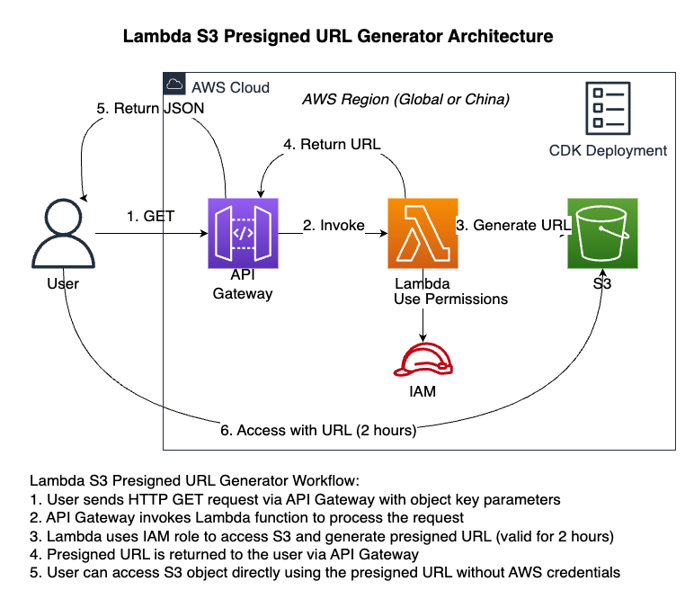

# Lambda S3 Presigned URL Generator

<div align="right">
  <a href="./README_CN.md">中文文档</a>
</div>

This project creates a serverless service using AWS Lambda and API Gateway to generate presigned URLs for S3 objects with a 2-hour validity period. The project can be deployed in both AWS global regions and AWS China regions.



## Architecture Overview

The application consists of the following AWS services:

- **AWS Lambda**: Executes the logic for generating presigned URLs
- **API Gateway**: Provides an HTTP interface to trigger the Lambda function
- **IAM Role**: Grants Lambda the necessary permissions to access S3
- **AWS CDK**: Used to deploy the entire infrastructure

## Workflow

1. User sends an HTTP GET request through API Gateway, including object key parameters
2. API Gateway invokes the Lambda function to process the request
3. Lambda uses IAM role to access S3 and generate a presigned URL (valid for 2 hours)
4. The presigned URL is returned to the user via API Gateway
5. User can directly access the S3 object using the presigned URL without AWS credentials

## Prerequisites

- Node.js 14.x or higher
- AWS CLI configured with appropriate regional credentials
- AWS CDK installed (`npm install -g aws-cdk`)

## Quick Start

```bash
# Install dependencies
npm install
cd lambda && npm install && cd ..

# Bootstrap CDK (first time only)
cdk bootstrap

# Deploy the stack (uses AWS CLI default region)
cdk deploy

# Or specify a region explicitly
cdk deploy --region us-east-1  # For global regions
cdk deploy --region cn-north-1  # For China regions
```

## Deployment Options

The application is designed to be region-agnostic and will use the region specified in your AWS configuration:

- **Default method**: Uses the region from your AWS CLI configuration
  ```bash
  # Check your current default region
  aws configure get region
  
  # Deploy using default region
  cdk deploy
  ```

- **Specify region with parameter**: Override the default region
  ```bash
  cdk deploy --region us-east-1
  ```

- **Using environment variables**: Set region via environment variables
  ```bash
  AWS_REGION=us-east-1 cdk deploy
  # or
  CDK_DEFAULT_REGION=us-east-1 cdk deploy
  ```

- **Using AWS profiles**: If you have multiple AWS profiles configured
  ```bash
  cdk deploy --profile your-profile-name
  ```

## Usage

### API Request Format

```
https://your-api-id.execute-api.[region].amazonaws.com/prod/generate-url?bucket=your-bucket-name&key=your-object-key
```

For China regions, the URL format is:
```
https://your-api-id.execute-api.[region].amazonaws.com.cn/prod/generate-url?bucket=your-bucket-name&key=your-object-key
```

### Response Example

```json
{
  "presignedUrl": "https://your-bucket.s3.[region].amazonaws.com/your-object-key?X-Amz-Algorithm=...",
  "expiresIn": "2 hours",
  "bucket": "your-bucket-name",
  "key": "your-object-key"
}
```
## Testing Examples

Here are examples of testing the API using curl:

```bash
# Generate a presigned URL
curl "https://your-api-id.execute-api.[region].amazonaws.com/prod/generate-url?key=example.txt"

# Access the object using the generated presigned URL
curl -s "$(curl -s "https://your-api-id.execute-api.[region].amazonaws.com/prod/generate-url?key=example.txt" | jq -r '.presignedUrl')"
```

## Customization

You can customize this project by modifying the following files:

- `lambda/index.js`: Modify the Lambda function logic
- `lib/lambda-gen-s3-stack.ts`: Modify the CDK infrastructure definition

## Cleanup

To delete the deployed resources, run:

```bash
cdk destroy
```

## Notes

1. Ensure your IAM user/role has sufficient permissions to deploy this stack
2. AWS services in China regions may have some special configuration requirements; refer to AWS China region documentation if you encounter issues
3. The presigned URL validity period is 2 hours, which can be adjusted by modifying the `expiresIn` parameter in `lambda/index.js`
4. Ensure the target S3 bucket exists and the Lambda function has permission to access it
