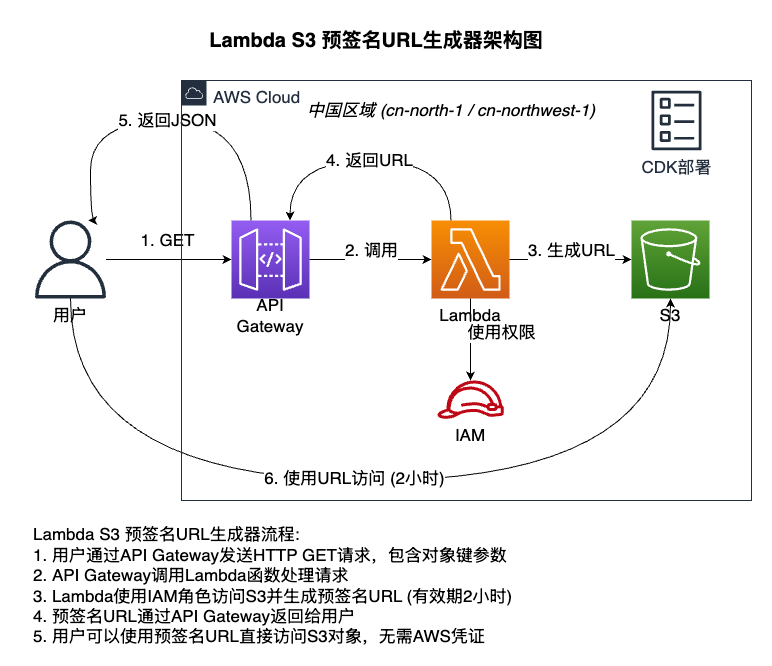

# Lambda S3 Presigned URL Generator

A serverless service using AWS Lambda and API Gateway to generate presigned URLs for S3 objects with a 2-hour validity period. This project can be deployed in both AWS global regions and AWS China regions.



[中文文档](./docs/README_CN.md) | [English Documentation](./docs/README_EN.md)

## Architecture Overview

The application consists of the following AWS services:

- **AWS Lambda**: Executes the logic for generating presigned URLs
- **API Gateway**: Provides an HTTP interface to trigger the Lambda function
- **IAM Role**: Grants Lambda the necessary permissions to access S3
- **AWS CDK**: Used to deploy the entire infrastructure

## Quick Start

```bash
# Install dependencies
npm install
cd lambda && npm install && cd ..

# Bootstrap CDK (first time only)
cdk bootstrap aws://ACCOUNT-NUMBER/REGION

# Deploy the stack
cdk deploy
```

For detailed deployment instructions and usage information, please refer to the [documentation](./docs/README_EN.md).
