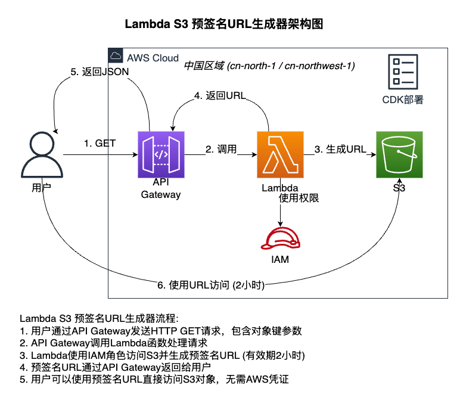

# Lambda S3 Presigned URL Generator

This project creates a serverless service using AWS Lambda and API Gateway to generate presigned URLs for S3 objects with a 2-hour validity period. The project can be deployed in both AWS global regions and AWS China regions.



## Architecture Overview

The application consists of the following AWS services:

- **AWS Lambda**: Executes the logic for generating presigned URLs
- **API Gateway**: Provides an HTTP interface to trigger the Lambda function
- **IAM Role**: Grants Lambda the necessary permissions to access S3
- **AWS CDK**: Used to deploy the entire infrastructure

## Workflow

1. User sends an HTTP GET request through API Gateway, including object key parameters
2. API Gateway invokes the Lambda function to process the request
3. Lambda uses IAM role to access S3 and generate a presigned URL (valid for 2 hours)
4. The presigned URL is returned to the user via API Gateway
5. User can directly access the S3 object using the presigned URL without AWS credentials

## Prerequisites

- Node.js 14.x or higher
- AWS CLI configured with appropriate regional credentials
- AWS CDK installed (`npm install -g aws-cdk`)

## Deployment Options

### Global Region Deployment (e.g., us-east-1)

1. Modify the `bin/lambda-gen-s3.ts` file to set the region to a global region:

```typescript
const app = new cdk.App();
new LambdaGenS3Stack(app, 'LambdaGenS3Stack', {
  env: { 
    account: process.env.CDK_DEFAULT_ACCOUNT, 
    region: 'us-east-1'  // Set to desired global region
  },
  description: 'Lambda and API Gateway for generating S3 presigned URLs',
});
```

2. Modify the region setting in the `lambda/index.js` file:

```javascript
// S3 client for global regions
const s3Client = new S3Client({
  region: process.env.AWS_REGION || 'us-east-1', // Use global region
});
```

3. If you need to set a default bucket, you can configure environment variables in `lib/lambda-gen-s3-stack.ts`:

```typescript
environment: {
  // Set default bucket name
  DEFAULT_BUCKET: 'your-bucket-name',
},
```

### China Region Deployment (cn-north-1 or cn-northwest-1)

1. Modify the `bin/lambda-gen-s3.ts` file to set the region to a China region:

```typescript
const app = new cdk.App();
new LambdaGenS3Stack(app, 'LambdaGenS3Stack', {
  env: { 
    account: process.env.CDK_DEFAULT_ACCOUNT, 
    region: 'cn-north-1'  // or 'cn-northwest-1'
  },
  description: 'Lambda and API Gateway for generating S3 presigned URLs',
});
```

2. Modify the region setting in the `lambda/index.js` file:

```javascript
// S3 client for China regions
const s3Client = new S3Client({
  region: process.env.AWS_REGION || 'cn-north-1', // or 'cn-northwest-1'
});
```

## Deployment Steps

1. Clone this repository
2. Install dependencies:

```bash
# Install main project dependencies
npm install

# Install Lambda function dependencies
cd lambda
npm install
cd ..
```

3. Bootstrap CDK (if this is your first time using CDK in this AWS account/region):

```bash
cdk bootstrap aws://ACCOUNT-NUMBER/REGION
```

4. Deploy the stack:

```bash
cdk deploy
```

5. After deployment, you will receive an API Gateway URL that can be used to generate presigned URLs.

## Usage

### API Request Format

```
https://your-api-id.execute-api.[region].amazonaws.com/prod/generate-url?bucket=your-bucket-name&key=your-object-key
```

For China regions, the URL format is:
```
https://your-api-id.execute-api.[region].amazonaws.com.cn/prod/generate-url?bucket=your-bucket-name&key=your-object-key
```

### Request Parameters

- `bucket`: Name of the S3 bucket (optional if DEFAULT_BUCKET is set in Lambda environment variables)
- `key`: S3 object key (path) (required)

### Response Example

```json
{
  "presignedUrl": "https://your-bucket.s3.[region].amazonaws.com/your-object-key?X-Amz-Algorithm=...",
  "expiresIn": "2 hours",
  "bucket": "your-bucket-name",
  "key": "your-object-key"
}
```

## Testing Examples

Here are examples of testing the API using curl:

```bash
# Generate a presigned URL
curl "https://your-api-id.execute-api.[region].amazonaws.com/prod/generate-url?key=example.txt"

# Access the object using the generated presigned URL
curl -s "$(curl -s "https://your-api-id.execute-api.[region].amazonaws.com/prod/generate-url?key=example.txt" | jq -r '.presignedUrl')"
```

## Customization

You can customize this project by modifying the following files:

- `lambda/index.js`: Modify Lambda function logic
- `lib/lambda-gen-s3-stack.ts`: Modify CDK infrastructure definition

## Cleaning Up Resources

To delete the deployed resources, run:

```bash
cdk destroy
```

## Notes

1. Ensure your IAM user/role has sufficient permissions to deploy this stack
2. AWS services in China regions may have some special configuration requirements; refer to AWS China region documentation if you encounter issues
3. The presigned URL validity period is 2 hours, which can be adjusted by modifying the `expiresIn` parameter in `lambda/index.js`
4. Ensure the target S3 bucket exists and the Lambda function has permission to access it
